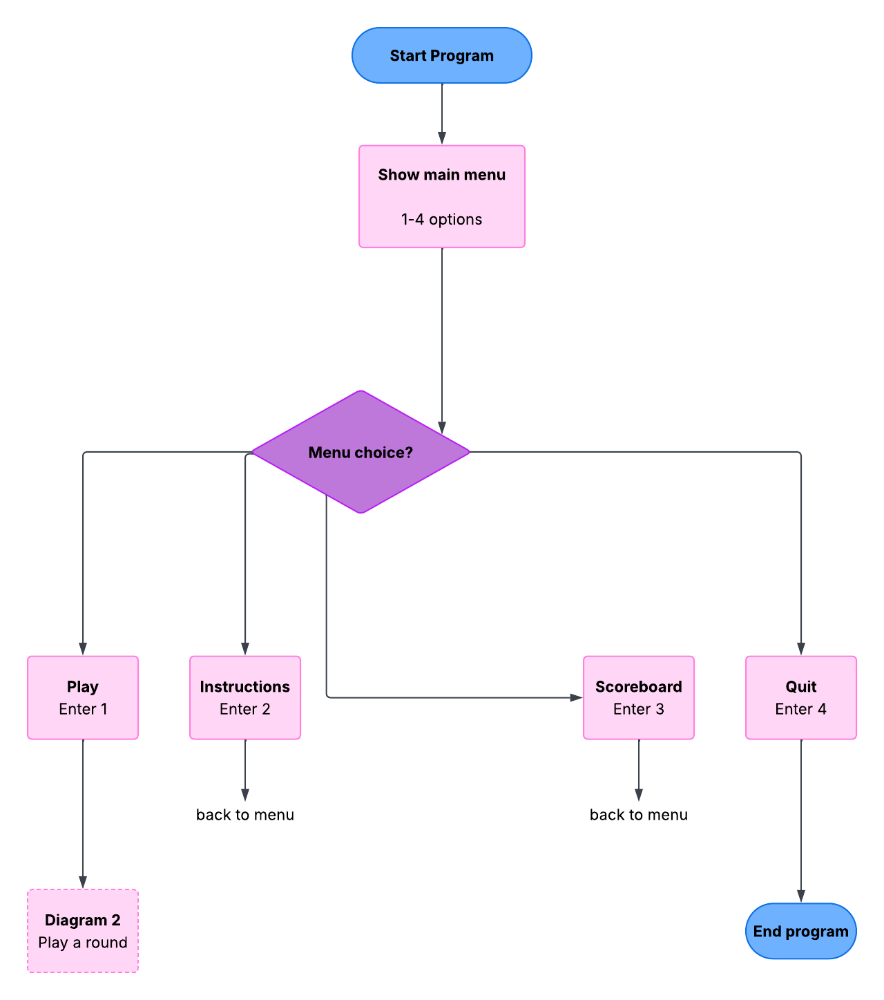
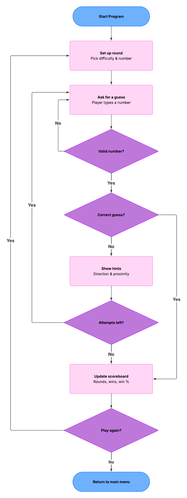

# Guess the Number

A number-guessing game with a main menu, difficulty levels, direction hints, tiered proximity hints, and a session scoreboard, built as my First Python Project submission.

---

## Flowcharts

### Main menu flow


### Play a round flow


---

## How to run

No external libraries needed, just Python 3 and its built-in `random` module.

```bash
python3 main.py
```

---

## How to play

1. From the main menu, choose **1** to play
2. Pick a difficulty: **Easy**, **Medium**, or **Hard**
3. Guess the random number within your attempt limit
4. After each incorrect guess, you get two hint:
    - **Direction:** Too Low or Too High
    - **Proximity:** Way Off, Off, Close, Very Close, Almost There
        (the closer your guess, the more specific the hint)
5. After each round you can choose to play again at the same difficulty, or return to the main menu.

### Difficulty levels

| Difficulty | Range | Attempts |
|---|---|---|
| Easy | 1-50 | 10 |
| Medium | 1-100 | 8 |
| Hard | 1-250 | 7 |

---

## Features

- Main menu: Play / Instructions / Scoreboard / Quit
- Difficulty selection, reusing the same settings/game logic
- Direction hints (too high / too low)
- Tiered proximity hints with icons (🧊,❄️ ☀️,🔥,🔥🔥)
- Input validation, non-numeric input doesn't cost an attempt
- Instructions available any time from the main menu
- Session scoreboard: rounds played, rounds won, win percentage, best (fewest-attempts) round
- Play-again loop so you can play multiple rounds without restarting the program

---

## Project / file structure

```
GuessTheNumber/
|
|- main.py              # entry point - starts the menu
|- menu.py              # main menu, navigation, play-again loop
|- game.py              # core gameplay: guessing, hints, difficulty choice
|-scoreboard.py         # session stats, using global counters
|- settings.py          # difficulty presets and current game settings
|
|- README.md
|- flowchart-menu.png   # main menu flowchart
|- flowchart-round.png  # play-a-round flowchart
```

---

## Design notes

- **Functions & modularity:** logic is split across five focused files, each with small, single-purpose functions (`get_valid_guess()`, `get_proximity_hint()`, `record_round()`, `choose_difficulty()`, etc)
- **Global counters:** `scoreboard.py` uses module-level counters (`rounds_played`, `rounds_won`, `best_attempts`) that live outside any function and are updated using the `global` keyword. `settings.py` similarly holds the current difficulty settings as global state shared across the whole program
- **Error handling:** `get_valid_guess()` catches non-numeric input with a `try`/`except` and re-prompts, without crashing or costing an attempt
- **Comments & docstrings:** every file and function has a docstring explaining its purpose; trickier logic (proximity thresholds) has inline comments
- **Clear instructions & feedback:** `show_instructions()` is available any time from the main menu, and reflects whichever difficulty is currently selected
- **Statistics:** rounds played, rounds won, win percentage, and best round are tracked and shown via the scoreboard
